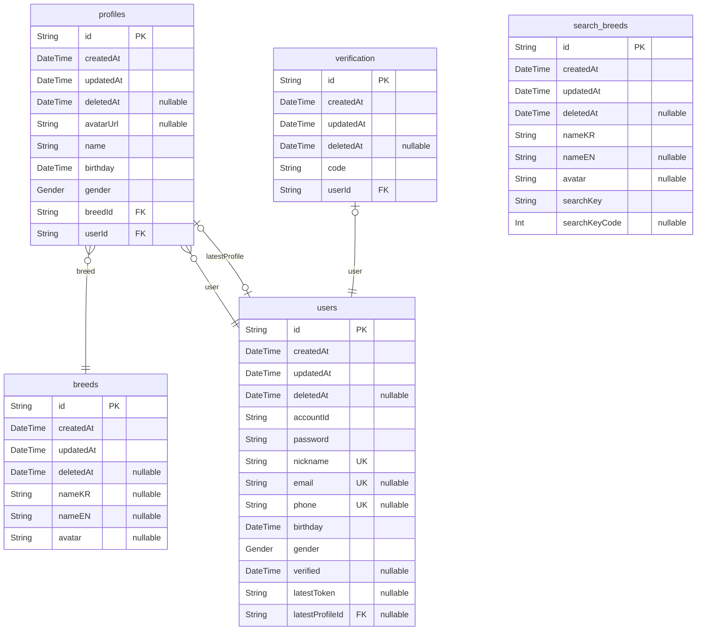

# Poop-backend
> Generated by [`prisma-markdown`](https://github.com/samchon/prisma-markdown)

- [default](#default)

## default

### `breeds`

**Properties**
  - `id`: 
  - `createdAt`: 
  - `updatedAt`: 
  - `deletedAt`: 
  - `nameKR`: 
  - `nameEN`: 
  - `avatar`: 

### `profiles`

**Properties**
  - `id`: 
  - `createdAt`: 
  - `updatedAt`: 
  - `deletedAt`: 
  - `avatarUrl`: 
  - `name`: 
  - `birthday`: 
  - `gender`: 
  - `breedId`: 
  - `userId`: 

### `users`

**Properties**
  - `id`: 
  - `createdAt`: 
  - `updatedAt`: 
  - `deletedAt`: 
  - `accountId`: 
  - `password`: 
  - `nickname`: 
  - `email`: 
  - `phone`: 
  - `birthday`: 
  - `gender`: 
  - `verified`: 
  - `latestToken`: 
  - `latestProfileId`: 

### `verification`

**Properties**
  - `id`: 
  - `createdAt`: 
  - `updatedAt`: 
  - `deletedAt`: 
  - `code`: 
  - `userId`: 

### `search_breeds`

**Properties**
  - `id`: 
  - `createdAt`: 
  - `updatedAt`: 
  - `deletedAt`: 
  - `nameKR`: 
  - `nameEN`: 
  - `avatar`: 
  - `searchKey`: 
  - `searchKeyCode`: 